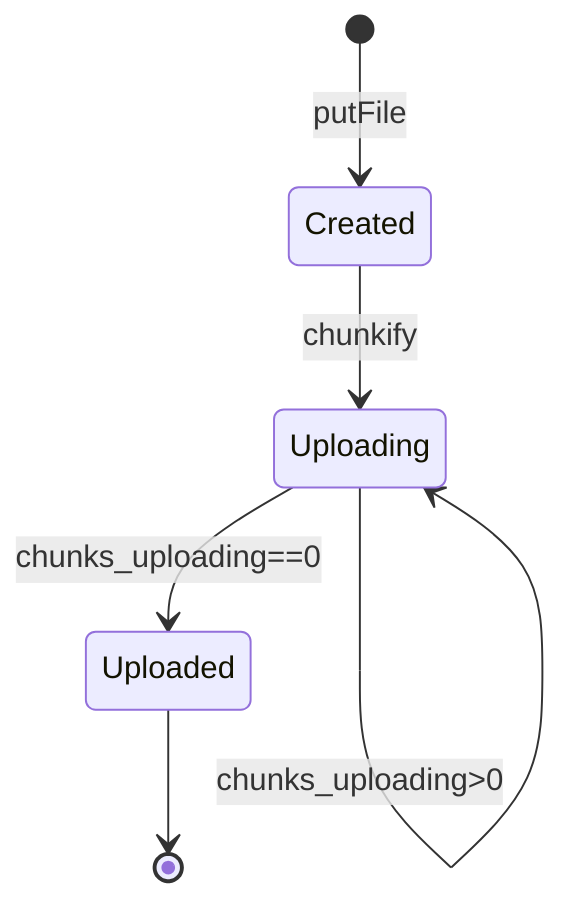
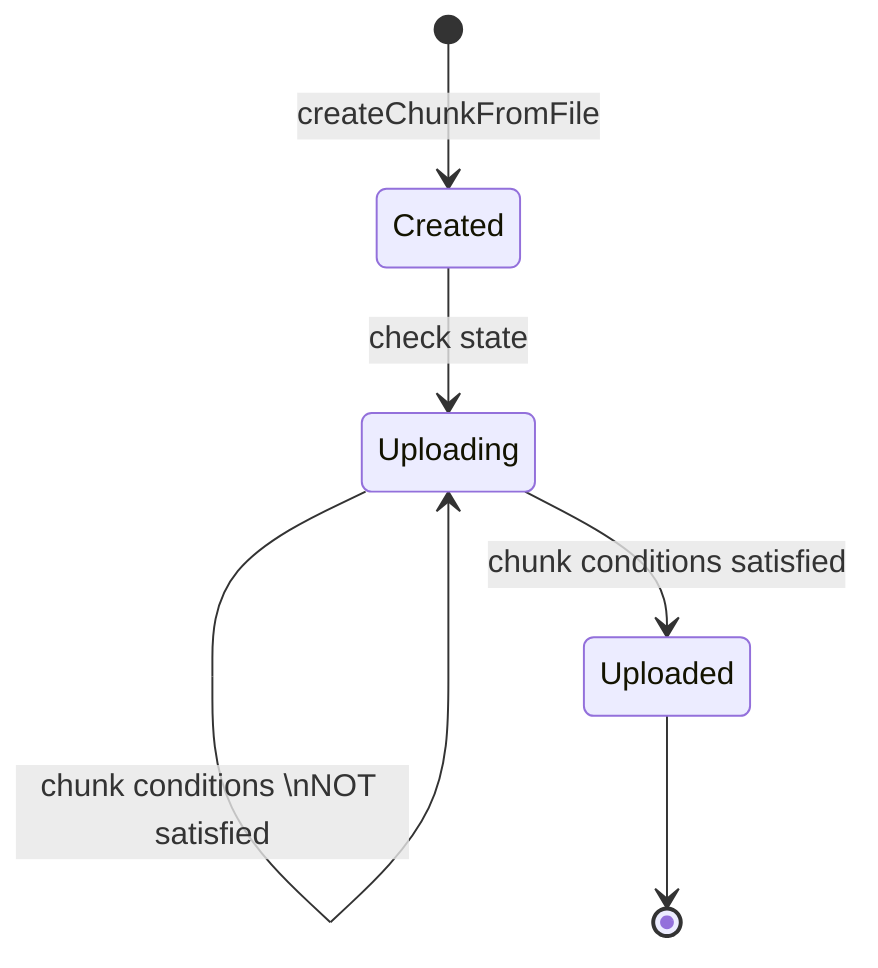
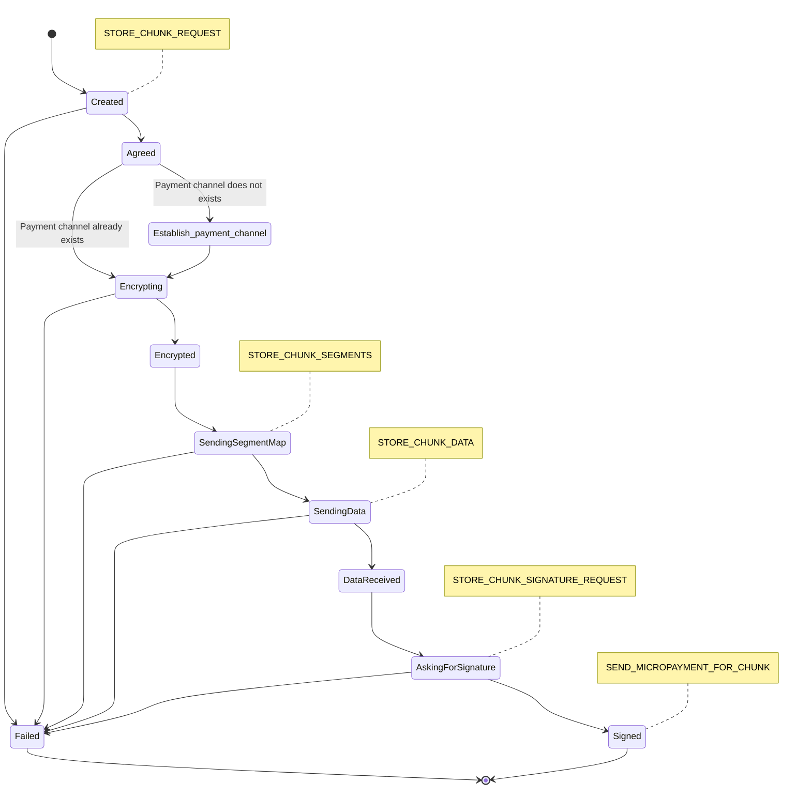

# Point Network Storage Layer

To save a file in the storage layer, a developer can call the putFile function passing in the file like so: `storage.putFile(filePath)`. This is a function call that will return the unique file id of the file originally located at the `filePath`.

Firstly we can outline this using high level state machine diagrams for `File`, `Chunk` and `ProviderLink` as follows.

## File States

## Chunk States

## Storage Link States

NOTE: Yellow boxes represent communication to the linked node.

## Process: upload and chunkify file

1. `Storage.putFile` - the public storage interface for storing a file on the network. It calls `Storage.enqueueFileForUpload` and waits to get the file id of the file (file may not be uploaded yet). Then waits until the File uploading status is `File.UPLOADING_STATUS_UPLOADED`. It also calls `Storage.chunkUploadingTick` to ensure the chunks are uploaded based on the expectations set in the file metadata.

1. `Storage.enqueueFileForUpload`- This calls `File.chunkify` (see details below) and sets the files metadata for redundancy, expiry and auto renew policies. Once the file is broken into chunks it calls `File.reconsiderUploadingStatus` (see below).

1. `File.chunkify` - splits the file by breaking the file into chunks of equal size of bytes upto the last chunk which may be smaller in size. It also creates a merkle tree using the chunk ids as the leaves. Each chunk has an initial state of `Chunk.UPLOADING_STATUS_CREATED`.

1. `File.reconsiderUploadingStatus` - sets the chunks metadata for **redundancy**, **expiry** and **auto renew** policies and then calls `Chunk.reconsiderUploadingStatus` for each chunk (see below).

1. `Chunk.reconsiderUploadingStatus` - checks that the chunk has the expected data redundancy (i.e. that it is stored in at least N providers) and that it has not expired. If any of these are not settled then the status of the chunk is set to Chunk.`UPLOADING_STATUS_UPLOADING` otherwise it is considered uploaded and so the status is set to `Chunk.UPLOADING_STATUS_UPLOADED`

1. `Storage.chunkUploadingTick` - this function is called as a result of the original call to `Storage.putFile` and it is also called on every ‘tick’ if there are any chunks that have a status Chunk.`UPLOADING_STATUS_UPLOADING`. In this function the chunks Storage Links  are pushed through various states of the uploading process and we can run though these states in the next step.

## Process: checking upload status

The `Storage.chunkUploadingTick` function checks, and potentially, modifies the state of all the Storage Links of an uploading file chunk. The state of the chunk must be in `Chunk.UPLOADING_STATUS_UPLOADING` for this function to proceed.

The function proceeds as follows:

1. Checks if the uploading chunk is required to be pushed to additional storage providers. It does this by fetching all the Storage Links for the chunk that have not failed and then compares that with the chunk redundancy to determine if more are required.

1. `StorageLink.STATUS_CREATED`: If additional Storage Providers are required then one is chosen using `chooseProviderCandidate()` function. The process of choosing a provider candidate is detailed elsewhere in the docs. A new Storage Link is created and the provider, **redkeyId**, and **chunk id** is set on this new instance.

1. `StorageLink.STATUS_AGREED`: A `STORE_CHUNK_REQUEST` call is made to the linked Storage Provider and if agreed a check to determine if there is an existing payment channel between the client and the storage provider is carried out using `checkExistingChannel()` function. If a channel exists the status is updated to `StorageLink.STATUS_AGREED` otherwise it is updated to `StorageLink.STATUS_ESTABLISH_PAYMENT_CHANNEL` if the `STORE_CHUNK_REQUEST` call fails it is updated to `StorageLink.STATUS_FAILED`. The `STORE_CHUNK_REQUEST` call is handled using a custom Kademlia plugin or middleware that defines this handler (more on networking in a separate section of the documentation). Note this is a request to another node to store the chunk and at this point the actual chunk data is not sent to the other node - only the id, length and expiry parameters are sent.

1. `StorageLink.STATUS_ESTABLISH_PAYMENT_CHANNEL`: The function then checks in the  `StorageLink.STATUS_ESTABLISH_PAYMENT_CHANNEL` state and creates a payment channel with the Storage Provider using `createChannel()` function. if successful the status is updated to `StorageLink.STATUS_AGREED`.

1. `StorageLink.STATUS_ENCRYPTING`: The function then checks all the Storage Links in the `StorageLink.STATUS_AGREED` state and begins the encryption process. The Storage Link state is first updated to `StorageLink.STATUS_ENCRYPTING`  and then the encryption process is performed by a forked child process that returns a message to the parent process when the encryption is complete.

1. `StorageLink.STATUS_ENCRYPTED`: The resulting encrypted chunk is split into multiple segment hashes used to produce a Merkle Tree representation of the chunk. This is then used to update the Storage Link once more with the resulting encrypted hash, encryption data length, segment hashes, merkle tree and merkle tree root. The status is updated to `StorageLink.STATUS_ENCRYPTED` at this point or `StorageLink.STATUS_FAILED` if the encryption process failed.

1. StorageLink.STATUS_SENDING_SEGMENT_MAP: The function then checks all the Storage Links in the `StorageLink.STATUS_ENCRYPTED` state and begins sending the segment map to the linked Storage Provider. It first sets the state to `StorageLink.STATUS_SENDING_SEGMENT_MAP` and then calls `STORE_CHUNK_SEGMENTS` on the linked Storage Provider. The status is then updated to either `StorageLink.STATUS_SENDING_DATA` if the request was successful or `StorageLink.STATUS_DATA_RECEIVED` if the response was ECHUNKALREADYSTORED from the linked Storage Provider. As always, if there was an error then the status is set to `StorageLink.STATUS_FAILED` .

1. `StorageLink.STATUS_SENDING_DATA`: The function then checks all the Storage Links in the `StorageLink.STATUS_SENDING_DATA` state and then prepares the data to be sent to the linked Storage Provider (which includes checking if chunks should be retransmitted due to a timeout condition). Once the data is prepared it calls `STORE_CHUNK_DATA`  which will invoke the equivalent function on the linked Storage Provider instance which will then store the data sent. On successful transmission of the data the Storage Link status is updated to `StorageLink.STATUS_DATA_RECEIVED` otherwise it is updated to `StorageLink.STATUS_FAILED`.

1. `StorageLink.STATUS_DATA_RECEIVED`: The function then checks all the Storage Links in the `StorageLink.STATUS_DATA_RECEIVED` state and updates the state to `StorageLink.STATUS_ASKING_FOR_SIGNATURE` and then sends a request to the linked Storage Provider for it to sign the chunk. Once it is successfully signed the status is changed to `StorageLink.STATUS_SIGNED` and the agreed micropayment is made to the Storage Provider using the makePayment() function. otherwise it is updated to `StorageLink.STATUS_FAILED`.
