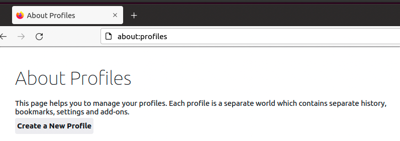
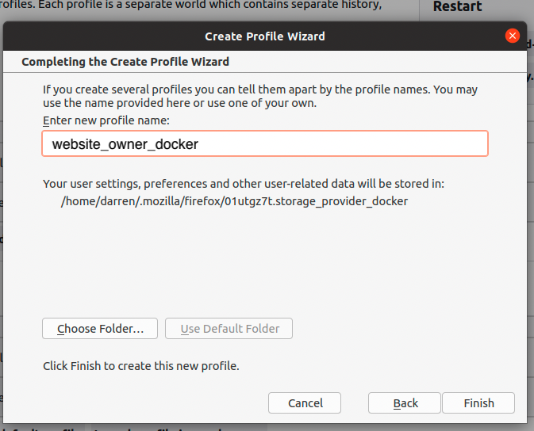
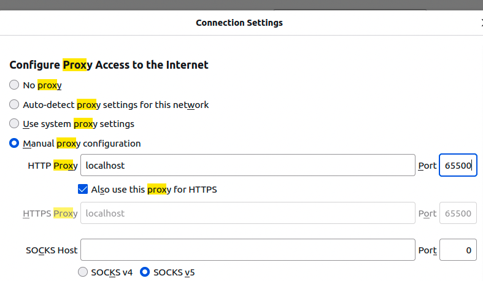

Welcome to the builder's section of the Point Network Wiki.

### Develop using docker compose

First add some alias and functions to your local bash environment. The project comes with a [`.bash_alias`](https://github.com/pointnetwork/pointnetwork/blob/develop/.bash_alias) file that contains a set of alias that are useful for this project. The quickest way to add these alias to your terminal session is to run `source .bash_alias`.

You can also copy the contents of the `.bash_alias` into your `~/.bash_profile` file and then run `source ~/.bash_profile` that way these alias commands will be available in every terminal session going forward.

Clone the pointnetwork repo, cd into and install deps like so:

```bash
git clone git@github.com:pointnetwork/pointnetwork.git
cd pointnetwork
npm i
```

Next, copy the *.env.e2e.example* file to *.env.e2e*:

```bash
cp .env.e2e.example .env.e2e
```

and set `DEV_ZAPP_HOST` envrionment variable in .env.e2e with the zapp domain that you are working with (e.g. pointsocial.z it would be set like this:

```bash
DEV_ZAPP_HOST=pointsocial.z
```

With the above out of the way, run the following:

NOTE: Since PointSocial Zapp uses React JS we need to make sure that the site is built locally first. For other Zapps you can check if dependencies are required and you only need to run `npm i`. For example in `email.z` there is a dev dependency required that needs to be installed before running the node.

```bash
cd example/pointsocial.z
npm i
npm run build      <-- only needed for building Zapps that use frontend libraries like React JS
```

In one terminal start all the services and watch the `website_owner` logs (NOTE: run these commands *from the root* of the cloned pointnetwork repo!)

```bash
dclean
point-e2e up -d
point-e2e logs -f website_owner
```

In another terminal (to connect to the `website_owner` node and deploy the site )

```bash
dexec pointnetwork_website_owner
./scripts/deploy-sites.sh pointsocial.z --contracts
```

The site should deploy sucessefully after a few minutes.

### Troubleshooting the deployment

If you see the following error:

```bash
Error: Could not find contract dependency, have you tried npm install?
```

Then its likely that the Zapp you are attempting to deploy is missing dependencies required for the deployment or for the runtime. To fix this, its best to stop the Point Node running, install the Zapp dependencies using `npm i` and then restarting the node and trying again.

If you see the following error:

```bash
Error: >>>>>>>>>>>>>>>>>>>>>>>> SOLIDITY COMPILATION ERRORS <<<<<<<<<<<<<<<<<<<<<<<<
Internal exception in StandardCompiler::compile: /solidity/libsolidity/interface/CompilerStack.cpp(104): Throw in function solidity::frontend::CompilerStack::CompilerStack(ReadCallback::Callback)
Dynamic exception type: boost::wrapexcept<solidity::langutil::InternalCompilerError>
std::exception::what: You shall not have another CompilerStack aside me.
[solidity::util::tag_comment*] = You shall not have another CompilerStack aside me.
```

... then it is usually due to installing dependencies after the Point Node has started. A simple restart of the Point Node should fix this.

### Open the deployed site in Point Browser

First create three profiles in Firefox to be able to test connecting to the different nodes quickly and easily. I suggest creating 3 profiles matching the names of the profiles set in your bash alias as mentioned above. NOTE: these profiles only need to be created once.

### Create a Point Network Profile in Firefox

1. Create a new Profile by navigating to `about:profiles` in Firefox.

|  |
| ------------------------------------- |

2. Enter the profile name in the wizard

Note we need to create 3 profiles so set the name to the profile you are currently creating

* `storage_provider_docker`
* `website_owner_docker`
* `website_visitor_docker`

|  |
| ------------------------------------- |

3. Configure the proxy for the specific profile

Note each profile that you are creating requires a spefific proxy setting. Please configure as shown below based on the profile you are currently adding:

* Profile `storage_provider_docker` : set proxy to `localhost:65500`
* Profile `website_owner_docker` : set proxy to `localhost:65501`
* Profile `website_visitor_docker` : set proxy to `localhost:65502`

|  |
| ------------------------------------- |

4. Import **and trust** the Point Network CA Certificate

Note the Point Network CA certificate is located in the [`client/proxy/certs`](https://github.com/pointnetwork/pointnetwork/tree/develop/client/proxy/certs) directory.

|  |
| ------------------------------------- |


Now clone the [PointSDK](https://github.com/pointnetwork/pointsdk) repo, cd into it and run the `point-browser-docker-2` alias command like so:

```bash
git clone git@github.com:pointnetwork/pointsdk.git
cd pointsdk
point-browser-docker-2
```

This should open the Point Browser with the `website_owner_docker` profile already configured to connect to the `website_owner` node and open [https://point](https://point). Now you can navigate to [https://point/identities](https://point/identities) and you should see the deployed pointsocial.z zapp listed, You can open it from there.

### Open the deployed site in a second Point Browser

To test out interacting between different Point Network identities we can open another Point Browser, for example the `website_visitor` like so (from the root of the pointsdk repo):

```bash
cd pointsdk
point-browser-docker-3
```

If you have added the above command as an alias and you have setup the Firefox profile you should see a new browser open that is connected to the `website_visitor` node. You can now post messages between each other on pointsocial!

### Next steps

Try to deploy the `store.z` app. To do so its just a matter of:

1. Install the deps in store.z `cd example/store.z && npm i`
1. Build the store.z site `cd example/store.z && npm run build`
1. Updating the `DEV_ZAPP_HOST` environment variable in *.env.e2e* to `DEV_ZAPP_HOST=store.z`
1. Tear down all the services (from the project root) `point-e2e down`
1. Clean all Docker containers and volumes `dclean`
1. Bring up all the services (from the project root) `point-e2e up -d`
1. Connect back into the `website_owner` running container: `dexec pointnetwork_website_owner`
1. Deploy store.z: `./scripts/deploy-sites.sh store.z --contracts`
1. Open a Point Browser instance to [https://store.z](https://store.z)

**Docker Compose Logs**

To follow the logs of *all* the containers simply run `point-e2e logs -f` in the terminal. If you want to follow the logs of a specific container, hten specify the service name as well like so: `point-e2e logs -f storage_provider` (to follow the logs of `storage_provider`)

**Docker Compose and Truffle Console**

Since the `blockchain_node` service is exposed via `http://localhost:7545` its therefore possible to use truffle console without any modification.

Therefore, *from the root* of the cloned pointnetwork repo, you can run:

```bash
 cd truffle
 truffle console
 ```

 The above will connect to the running Ganache blockchain in the Docker `blockchain_node` service.

 **Docker complete database reset**

 There is a simple command in the alias list above that will tear down all services, remove orphen containers and remove all volumes. *Only run this command if you are ok with it clearing out your Docker volumes etc*. Check the alias for its exact functionality. The command run is:

 ```bash
 dclean
 ```

### Coding style

Following coding style applies:

* Always use semicolons otherwise [dragons may bite you](https://www.freecodecamp.org/news/codebyte-why-are-explicit-semicolons-important-in-javascript-49550bea0b82/)!
* Use 4 spaces as a default indent for all files and set this in your IDE.