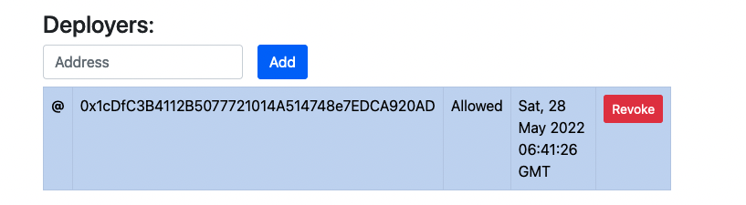

 
You may wish to delegate another Identity permission to update your dApp on your behalf. 
 
Once you have deployed your dApp you are the owner of that dApp. Only you can update it by redeploying it.
 
If you want you can assign multiple trusted Identities within Point Network and give them the authority to update your dApp.
 
## Using the CLI
 
### List the Deployers 
 
To list the existing set of deployer Identities associated with a dApp you can use the `identity-list-deployers` Hardhat Task like so:
 
```
npx hardhat identity-list-deployers 0xD61e5eFcB183418E1f6e53D0605eed8167F90D4d "social" --network development
```
 
The above example will list the addresses of the Identities who are designated deployer Identities for the "social" dApp deployed in the 'development' network
 
### Assign a new deployer Identity to a dApp 
 
To add a new deployer Identity to an existing dApp you will first of all need to be the owner of that dApp. You can then use the `identity-add-deployer` Hardhat Task to add a new deployer Identity to the dApp like so. 
 
```
npx hardhat identity-add-deployer 0xD61e5eFcB183418E1f6e53D0605eed8167F90D4d "social" 0x1cDfC3B4112B5077721014A514748e7EDCA920AD 0x916f8E7566Dd63D7c444468CaDeA37e80f7F8048 --network development
```
 
The above command will add the deployer Identity `0x1cDfC3B4112B5077721014A514748e7EDCA920AD` to the "social" dApp Identity deployed to the 'development' network. The format of the Hardhat Task is:
 
```
npx hardhat identity-add-deployer IDENTITY_CONTRACT_ADDRESS DAPP_IDENTITY NEW_DEPLOYER_IDENTITY_ADDRESS DAPP_OWNER_ADDRESS --network development
```
 
### Remove deployer Identity from a dApp
 
To remove a deployer Identity from the list of authorized dApp deployers you can use the `identity-remove-deployer` Hardhat task:
 
```
npx hardhat identity-remove-deployer 0xD61e5eFcB183418E1f6e53D0605eed8167F90D4d "social" 0x1cDfC3B4112B5077721014A514748e7EDCA920AD 0x916f8E7566Dd63D7c444468CaDeA37e80f7F8048 --network development
```
 
The above command will remove the Identity `0x1cDfC3B4112B5077721014A514748e7EDCA920AD` from the "social" dApp deployed to the "development" environment. The format of the Hardhat Task is the same as `identity-add-deployer` above.
 
## Using Point Explorer Identity Management dApp
 
Its possible to manage dApp deployer identities via the Point Explorer Identity Management dApp too. Assuming you have deployed Point Social to your local development environment you can open the Identity page for the Point Social dApp in Point Explorer [here](https://point/identities/social) (NOTE: link needs to be opened in Point Browser)
 
Scroll to the "Deployers" section. Initially it will appear empty like so:
 
|  |
| ------------------------------------- |
 
Copy paste the address of the deployer you want to assign into the address text box and click the Add button. 
 
Once the transaction has been mined, the deployer address will be added to the list like so:
 
|  |
| ------------------------------------- |

Note that you can click the "Revoke" button next to the deployer Identity in the list to remove them.