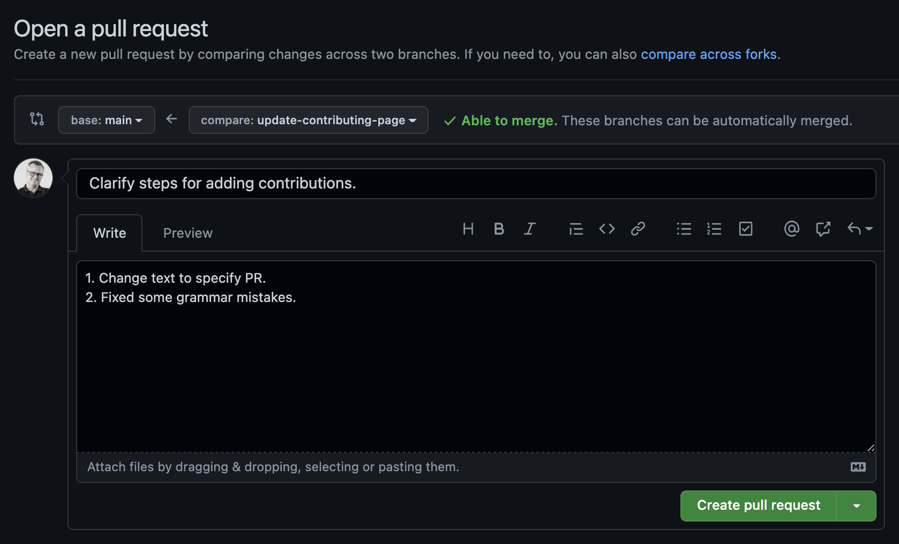

The wiki was started and is maintained by Point Network. It is an open source project and aims
to be the most extensive resource of knowledge on Point Network and the Point Network ecosystem. A large part
of the material currently focuses on Point Network directly but it is not opposed to covering
informational material for community projects.

**Please do not try to pull request any marketing material as this will be rejected.**

Nonetheless, pull requests, discussions, and contributions from the community are encouraged. Active
community members who demonstrate a record of good contributions may be given write access to the
repository.

Otherwise, the Point Netowrk team holds the administrative position and final say on the content that is
included. Specifically, the Technical Education team at Point Network are most directly involved.

## How to Contribute

You can contribute to the wiki on the
[Point Network-wiki GitHub repository](https://github.com/pointnetwork/pointnetwork.github.io). Every page is a
[MarkDown](https://guides.github.com/features/mastering-markdown/) file, which is an easy to learn
syntax extension to plain text that makes creating links, rendering images, and nice-looking
formatting simple.

Using the GitHub built-in text editor you can make your edits directly to the Point Network wiki.
When you've completed your changes, you can add any specific details on what was changed and commit to a **new branch** to create a new Pull Request to the repository. From there one of the maintainers will review your changes, and either merge them or request changes.

 

Remember that after you click "Propose Changes", you must also click on "Create Pull Request" on the
next page.

## Rules

There are a few basic ground-rules for contributors:

1. **No `--force` pushes** or modifying the Git history in any way.
2. Pull requests are preferred to issues, especially for small changes such as typos. Issues should
   be used for generic or broad-based changes or missing content. Suggestions and requests are encouraged.
3. Only use **non-master branches**.
4. **Significant modifications**, even by contributors, ought to be subject to a **pull request** to
   solicit feedback from other contributors.
5. Pull requests to solicit feedback are _encouraged_ for any other non-trivial contribution but
   left to the discretion of the contributor.
6. Contributors should attempt to adhere to the prevailing `MarkDown` style, language, and layout.
7. Correct grammar should be used at all times. Pull requests with typos will not be merged until
   fixed.
8. Care should be taken to remain as objective and informative as possible. There should be no
   editorializing, and external bias should not be present.

## Heritage

This document is based on the
[Polkadot Wiki contribution guidelines](https://github.com/w3f/polkadot-wiki/blob/master/docs/general/contributing.md).
